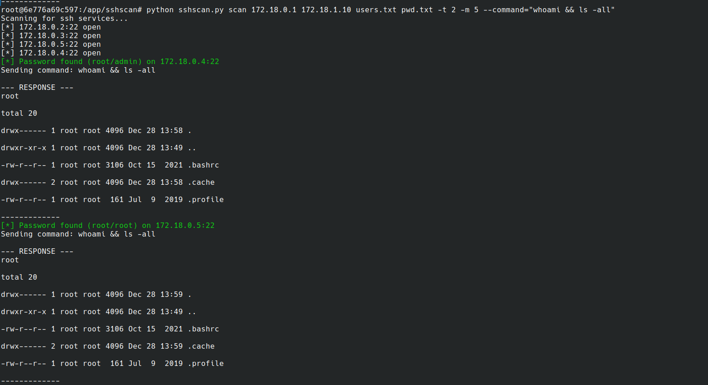

# sshscan

## Introduction
sshscan is an open source penetration testing tool, able to perform a password spraying attack against ssh services. It can also automatically execute bash code on the target machine after gaining acces


## Installation


### Linux distro
```bash
pip install -r requirements.txt
 ```

### From virtual env
```bash
python3 -m venv sshscan
source sshscan/bin/activate
pip install -r requirements.txt

 ```

## Usage
```bash

usage: sshscan.py [-h] [--verbose] [--port PORT] [--max-thread MAX_THREAD] [--timeout TIMEOUT] [--command COMMAND] [--payload PAYLOAD]
                  [--upload-dir UPLOAD_DIR]
                  start_ip end_ip user_file password_file

SSH penetration testing tool

positional arguments:
  start_ip              Start ip address
  end_ip                Stop ip address
  user_file             Users file list
  password_file         Password file list

options:
  -h, --help            show this help message and exit
  --verbose             Set verbose output
  --port PORT           Default ssh port
  --max-thread MAX_THREAD
                        Max threads
  --timeout TIMEOUT     Connection timeout
  --command COMMAND     Shell command
  --payload PAYLOAD     Payload file
  --upload-dir UPLOAD_DIR
                        Upload directory


```
## Examples

### Default scan
```bash
./sshscan.py 192.168.178.49 192.168.178.51 users.txt passwords.txt

```

### Execute command
```bash
./sshscan.py 192.168.178.49 192.168.178.51 users.txt passwords.txt --port 2222 --verbose --command "whoami && ls -all"

```


# Screenshot


